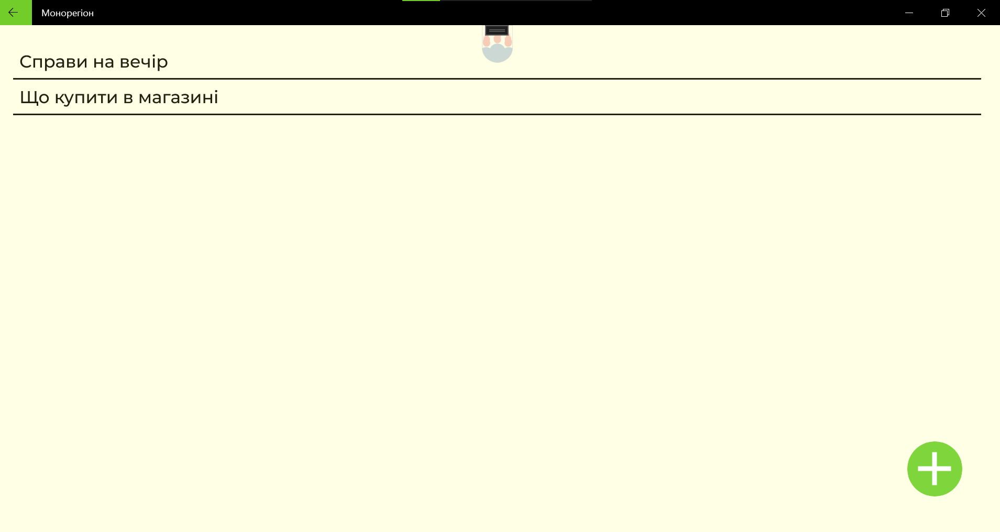

### It is my personal demo project was created with next technologies:

- C# 
- .NET(Standart 2.0, Core 7.0)
- Xamarin.Forms,
- ASP.NET Core,
- Prism.Unit,
- Microsoft.Datasync,
- SQLite(code-based) and others

- git(?)

Here developed application for notes. Not multi-usered but with synchronization function via few instance of app

### Functions of application:

- directions creation and removing
- records creation, editing and removing
- everyminutes avtosaving of record
- syncroniazation with server`s DB

### Functions of server

- syncroniazation betwen server`s DB and local DB

### Features

- multiplatform(tested on Droid and UWP, not optimized for iOS)

### Screens of application:

Add diretion on UWP

List of directions

Write record

List of records

Confirm and run synchronization

Add direction on mobile

Run syncronization on mobile also

List of directions

Write record

List of records

### Negative moments:
- I had to build DLLs of datasync client and directly refers to them instead nuget packages(official releases restrict connections via https only)